# SideHustle

This website aims to provide a convenient place to find services that could make people's lives easier, as well as a place where service providers can earn money and hone their skills. 

Why? For the service providers, a formal job can be hard to find, a potentially very big commitment, and, in most cases, unfortuantely, the work is not that enjoyable. This site gives providers an opportunity to find work with hours that suit them, and they can choose to offer services that they would enjoy providing.

For customers, it can be hard to find people to get useful jobs done. From cleaning a wheelie bin to tutoring their kids, this site allows them to find people who are willing to do those jobs. Customers can choose from the list of services already being offered, or they can request a service that they don't see on offer, providing a useful signal to service providers that there is demand for such a service.

There are a few existing websites that offer similar environments, with TaskRabbit, Airtasker, Bizzby and Craiglist likely being the most well known. However, these sites either don't operate in Ireland or are note very popular here. There is scope for the growth of these sort of websites in Ireland, and an Irish-based site like SideHustle may be the best candidate to drive that growth.

The target audience for this site would be anyone who has a skill to offer or anyone who needs help with a problem.

View the live site [here.](https://adam-pp4-workapp.herokuapp.com/)


# User-Experience-Design

## The-Strategy-Plane

### Agile Planning

This project was developed using agile methodologies. Epics(milestones) were broken down into User Stories, and then broken down even further into tasks. Acceptance Criteria and Dependcies were also laid out in the User Stories.

The Kanban board was created using github projects and can be located [here](https://github.com/users/adammkeane/projects/5/views/1).

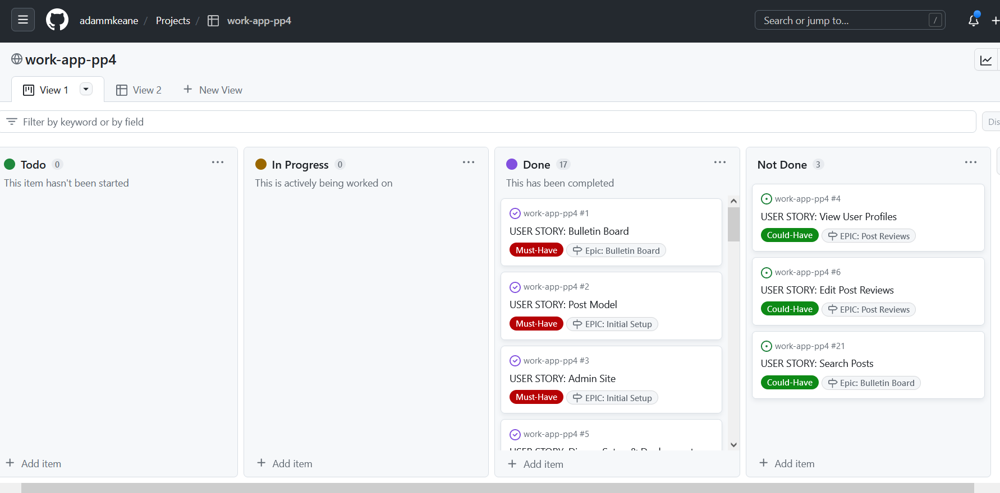
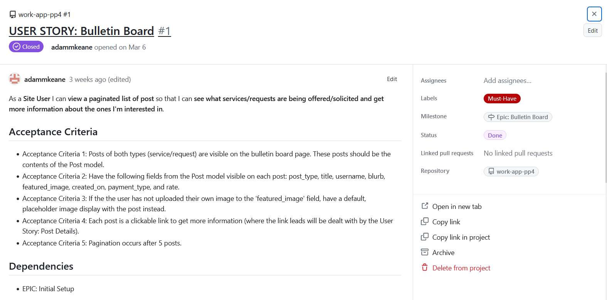
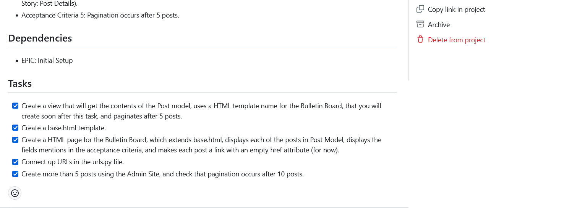

**EPIC 1 - Initial Setup**
- USER STORY: Django Setup & Deployment
- USER STORY: Admin Site
- USER STORY: Post Model

**EPIC 2 - Bulletin Board**

- USER STORY: Bulletin Board
- USER STORY: Split Bulletin Board
- USER STORY: Post Details
- USER STORY: Search Posts

**EPIC 3 - Site Basics**

- USER STORY: Home Page
- USER STORY: Nav Bar/Bootstrap Install
- USER STORY: Footer
- USER STORY: Allauth/User Authorization Management

**EPIC 4 - Post CRUD Model**
- USER STORY: Create Post
- USER STORY: View User's Post (Profile Page)
- USER STORY: Edit Post
- USER STORY: Delete Post

**EPIC 5 - Post Reviews**
- USER STORY: PostReview Model
- USER STORY: Create Post Reviews
- USER STORY: Edit Post Reviews
- USER STORY: View Post Reviews
- USER STORY: Delete Post Reviews

## The-Scope-Plane

* Responsive Design - Site should be fully functional on all devices from 320px up
* Hamburger menu for mobile devices
* Ability to perform CRUD functionality on Post model.
* Some restricted access for signed in users and post creators.

## The-Structure-Plane

### Features

**Bulletin Board**

``USER STORY - As a Site User I can view a paginated list of post so that I can see what services/requests are being offered/solicited and get more information about the ones I'm interested in.``

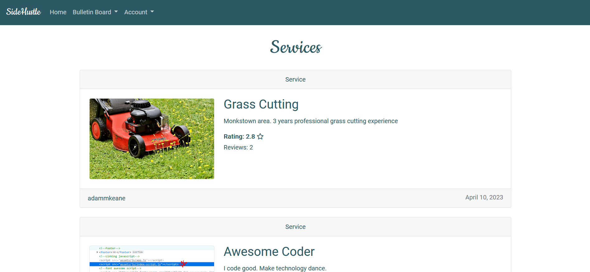
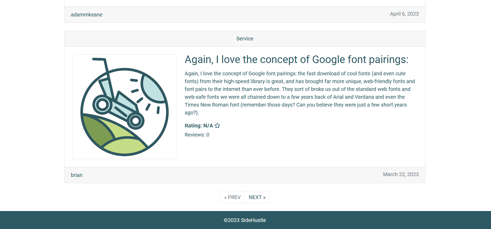

**Post Reviews**

``USER STORY - As a Site User I can view review scores for posts so that I can have useful information when deciding whether or not I should engage with the post and trust the poster.``

``USER STORY - As a Site User I can create a review of a post so that I can share useful knowledge with other site users.``

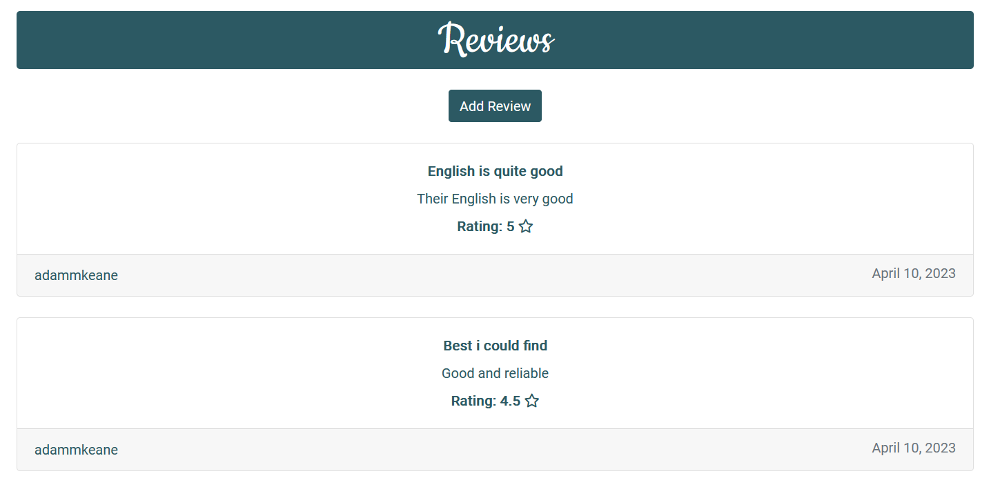

**Profile Page**

``USER STORY - As a Site User I can view a User's Profile Page (including mine own), which contains a list of all posts from that User so that I can either keep track of my own posts, or get more information about another Users services/requests.``

``USER STORY - As a Site User I can edit my posts so that I can makes changes after the initial posting.``

``USER STORY - As a Site User I can delete my posts so that I can remove posts that I have no more need for.``

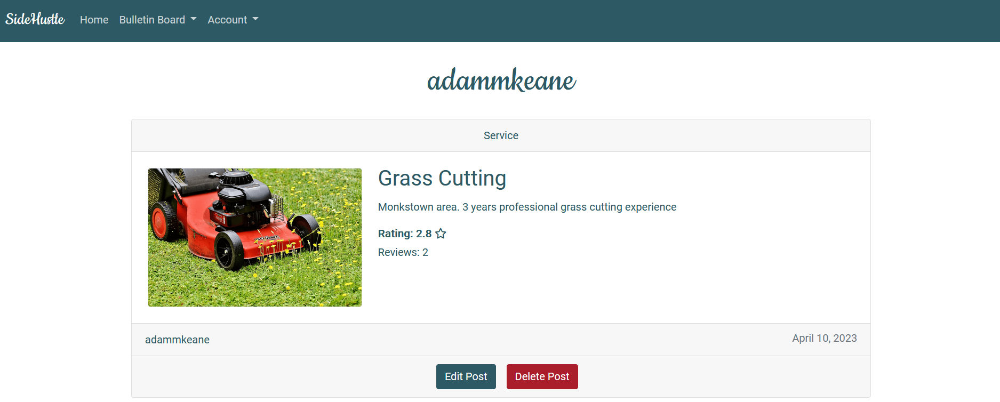

## The-Skeleton-Plane

### Wireframes

- Home Page


- Bulletin Board


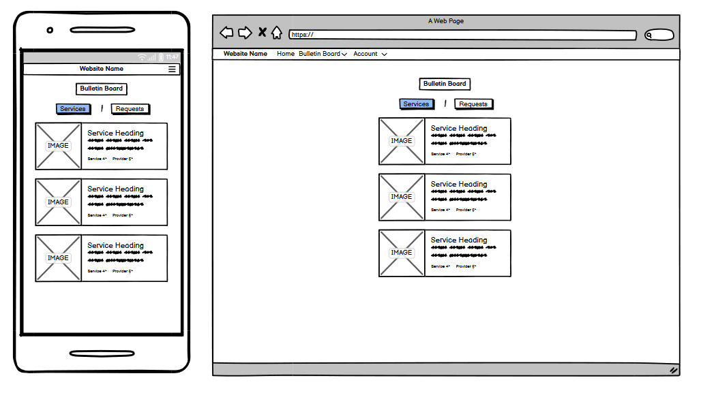

- Bulletin Home

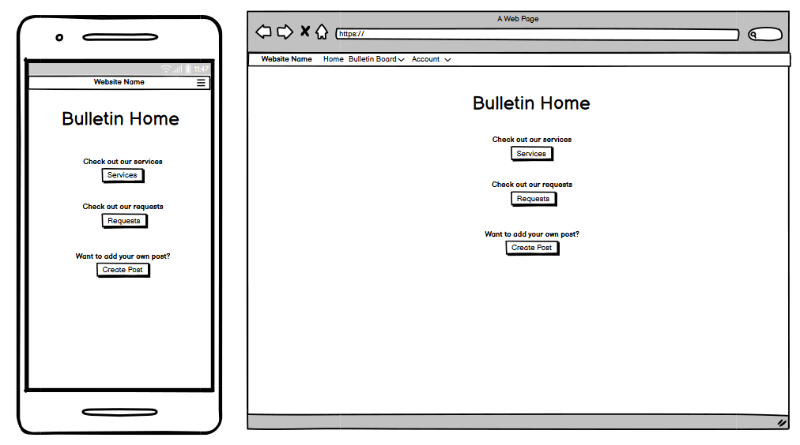

- Post Detail

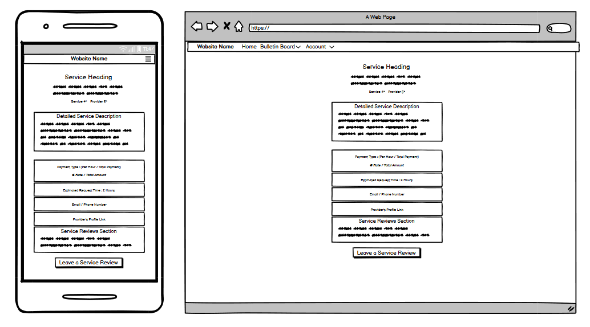

- Profile Page

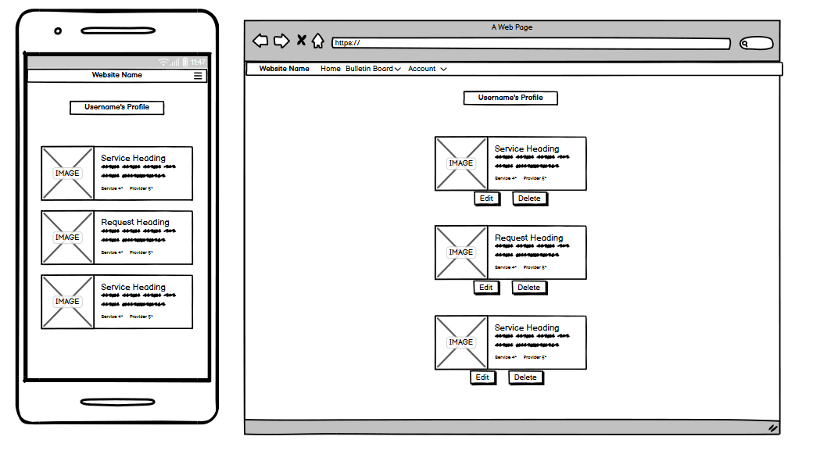

### Database-Design
The database was designed to allow CRUD functionality to be available to signed in users. Post model has full CRUD functionailty. PostReview model has only CR functionality.

These to models are linked to each other and to Django's User model with foreign key relationships.

### Security

Views were secured by using the django class based view mixin, UserPassesTextMixin. A test function was created to use the mixin and checks were ran to ensure that the user who is trying to access the page is authorized. Any staff restricted functionality, user edit/delete functionality listed in the features was secured using this method.

Environment variables were stored in an env.py for local development for security purposes to ensure no secret keys, api keys or sensitive information was added the the repository. In production, these variables were added to the heroku config vars within the project.
 
## Technolgies

- HTML
  - The structure of the Website was developed using HTML as the main language.
- CSS
  - The Website was styled using custom CSS in an external file.
- JavaScript
  - JavaScript was by bootrap to create its features
- Python
  - Python was the main programming language used for the application using the Django Framework.
- GitHub
  - Source code is hosted on GitHub
- Git
  - Used to commit and push code during the development of the Website
- Font Awesome
  - This was used for various icons throughout the site
- Favicon.io
  - favicon files were created at https://favicon.io/favicon-converter/
- balsamiq
  - wireframes were created using balsamiq from https://balsamiq.com/wireframes/desktop/#

## Testing 

Automated testing was carried out with the unittest. 18 automated tests were created and all passed.

All python files passed CI Python Linter tool.


### Responsiveness

All pages were tested to ensure responsiveness on screen sizes from 320px x 634px and upwards as defined in [WCAG 2.1 Reflow criteria for responsive design](https://www.w3.org/WAI/WCAG21/Understanding/reflow.html) on Chrome, Edge, Firefox and Opera browsers.

Steps to test:

1. Open browser and navigate to [SideHusle](https://adam-pp4-workapp.herokuapp.com/)
2. Open the developer tools (right click and inspect)
3. Set to responsive and decrease width to 320px and height to 634px.
4. Set the zoom to 50%
5. Click and drag the responsive window to maximum width

Expected:

Website is responsive on all screen sizes and no images are pixelated or stretched.
No horizontal scroll is present.
No elements overlap.

Actual:

Expcted outcome was seen.

Website was also opened on the following devices and no responsive issues were seen:

- Google Pixel 3a
- Dell XPS 15
- iPhone Mini


### Accessibility

[Wave Accessibility](https://wave.webaim.org/) tool was used throughout development and for final testing of the deployed website to check for any aid accessibility testing.

Testing was focused to ensure the following criteria were met:

- All forms have associated labels or aria-labels so that this is read out on a screen reader to users who tab to form inputs
- Color contrasts meet a minimum ratio as specified in [WCAG 2.1 Contrast Guidelines](https://www.w3.org/WAI/WCAG21/Understanding/contrast-minimum.html)
- Heading levels are not missed or skipped to ensure the importance of content is relayed correctly to the end user
- All content is contained within landmarks to ensure ease of use for assistive technology, allowing the user to navigate by page regions
- All not textual content had alternative text or titles so descriptions are read out to screen readers
- HTML page lang attribute has been set
- Aria properties have been implemented correctly
- WCAG 2.1 Coding best practices being followed

## Deployment

### Version Control

The site was created using the Visual Studio Code editor and pushed to github to the remote repository ‘Gars-Steakhouse’.

The following git commands were used throughout development to push code to the remote repo:

```git add <file>``` - This command was used to add the file(s) to the staging area before they are committed.

```git commit -m “commit message”``` - This command was used to commit changes to the local repository queue ready for the final step.

```git push``` - This command was used to push all committed code to the remote repository on github.

### Heroku Deployment

The site was deployed to Heroku. The steps to deploy are as follows:

- Navigate to heroku and create an account
- Click the new button in the top right corner
- Select create new app
- Enter app name
- Select region and click create app
- Click the resources tab and search for Heroku Postgres
- Select hobby dev and continue
- Go to the settings tab and then click reveal config vars
- Add the following config vars:
  - SECRET_KEY: (Your secret key)
  - DATABASE_URL: (This should already exist with add on of postgres)
  - CLOUNDINARY_URL: (cloudinary api url)
- Click the deploy tab
- Scroll down to Connect to GitHub and sign in / authorize when prompted
- In the search box, find the repositoy you want to deploy and click connect
- Scroll down to Manual deploy and choose the main branch
- Click deploy

The app should now be deployed.
